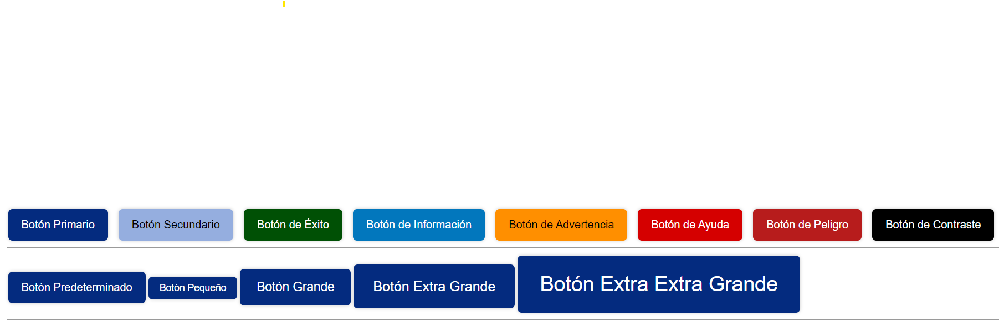

# Components

## Button

El componente `Button` se utiliza para representar botones en la interfaz de usuario.

### Props

- **variation**: `String`

  - Tipo: `String`
  - Valores posibles: `primary`, `secondary`, `success`, `info`, `warning`, `help`, `danger`, `contrast`
  - Valor predeterminado: `primary`

- **size**: `String`
  - Tipo: `String`
  - Valores posibles: `small`, `medium`, `large`
  - Valor predeterminado: `medium`


### Ejemplo de Implementación


```vue
<template>
  <div>
    <h1>Buttons</h1>
    <ButtonRd severity="primary" @accion="handleAccionClick">Primary</ButtonRd>
    <ButtonRd severity="secondary" @accion="handleAccionClick">Secondary</ButtonRd>
    <ButtonRd severity="success" @accion="handleAccionClick">Success</ButtonRd>
    <ButtonRd severity="info" @accion="handleAccionClick">Info</ButtonRd>
    <ButtonRd severity="warning" @accion="handleAccionClick">Warning</ButtonRd>
    <ButtonRd severity="help" @accion="handleAccionClick">Help</ButtonRd>
    <ButtonRd severity="danger" @accion="handleAccionClick">Danger</ButtonRd>
    <ButtonRd severity="contrast" @accion="handleAccionClick">Contrast</ButtonRd>
    <br />
    <button class="button-rd button-primary">Botón Predeterminado</button>
    <button class="button-rd button-primary button-sm">Botón Pequeño</button>
    <button class="button-rd button-primary button-lg">Botón Grande</button>
    <button class="button-rd button-primary button-xl">
      Botón Extra Grande
    </button>
    <button class="button-rd button-primary button-xxl">
      Botón Extra Extra Grande
    </button>
  </div>
</template>

<script>
import ButtonRd from "@/components/ButtonRd.vue";

export default {
  components: {
    ButtonRd,
  },
  methods: {
    handleAccionClick() {
      console.log("Botón con acción clicado");
    },
  },
};
</script>
```

## Heading

El componente `Heading` se utiliza para mostrar encabezados de diferentes niveles en la interfaz de usuario.

### Props

- **level**: `Number`
  - Tipo: `Number`
  - Valores posibles: `1`, `2`, `3`
  - Valor predeterminado: `1`

### Ejemplo de Implementación

```vue
<template>
  <div>
    <HeadingRd level="1">Encabezado de Nivel 1</HeadingRd>
    <HeadingRd level="2">Encabezado de Nivel 2</HeadingRd>
    <HeadingRd level="3">Encabezado de Nivel 3</HeadingRd>
  </div>
</template>

<script>
import HeadingRd from "@/components/HeadingRd.vue";

export default {
  components: {
    HeadingRd,
  },
};
</script>
```

## Breadcrumb

El componente `BreadcrumbRd` se utiliza para proporcionar una navegación de migas de pan, que ayuda a los usuarios a entender y explorar la estructura de navegación de un sitio web de manera eficiente.

### Props

- **items**: `Array`
  - Tipo: `Array`
  - Descripción: Un arreglo de objetos que representa cada miga de pan.
  - Cada objeto contiene:
    - `label`: `String` - El texto que se muestra para la miga de pan.
    - `url`: `String` - El enlace al que dirige la miga de pan.

### Ejemplo de Implementación

```vue
<template>
  <div>
    <BreadcrumbRd :items="breadcrumbItems" />
  </div>
</template>

<script>
import BreadcrumbRd from '@/components/BreadcrumbRd.vue';

export default {
  components: {
    BreadcrumbRd
  },
  data() {
    return {
      breadcrumbItems: [
        { label: 'Inicio', url: '/' },
        { label: 'Sección 1', url: '/seccion1' },
        { label: 'Página Actual', url: '/seccion1/pagina-actual' }
      ]
    };
  }
};
</script>

```


## InputRd

El componente `InputRd` es un campo de entrada personalizable que se ajusta a diferentes tamaños y ofrece variaciones de tipo para adaptarse a distintas necesidades de datos en formularios.

### Props

- **id**: `String`
  - Identificador único para el elemento input y su etiqueta correspondiente.
  
- **label**: `String`
  - Etiqueta descriptiva que se muestra junto al campo de entrada.
  
- **type**: `String`
  - Define el tipo de input. Ejemplos comunes incluyen "text", "password", "email", etc.
  - Valor predeterminado: `"text"`
  
- **placeholder**: `String`
  - Texto de guía que se muestra en el campo de entrada cuando está vacío.
  
- **size**: `String`
  - Ajusta el tamaño visual del campo de entrada.
  - Valores posibles: `"sm"`, `"md"`, `"lg"`
  - Valor predeterminado: `"md"`
  - El tamaño afecta las clases CSS aplicadas para el diseño del campo.

### Data

- **inputValue**: `String`
  - Modelo de datos que captura y almacena el valor ingresado por el usuario en el campo de entrada.

### Computed

- **computedClasses**: `String`
  - Genera clases dinámicas basadas en la propiedad `size` para aplicar estilos específicos.

### Ejemplo de Implementación

```vue
<template>
  <div>
    <InputRd
      id="input-small"
      label="Small Input"
      type="text"
      placeholder="Small size"
      size="sm"
    />
    <InputRd
      id="input-medium"
      label="Medium Input"
      type="text"
      placeholder="Medium size"
      size="md"
    />
    <InputRd
      id="input-large"
      label="Large Input"
      type="text"
      placeholder="Large size"
      size="lg"
    />
  </div>
</template>

<script>
import InputRd from '@/components/InputRd.vue';

export default {
  components: {
    InputRd
  }
};
</script>
